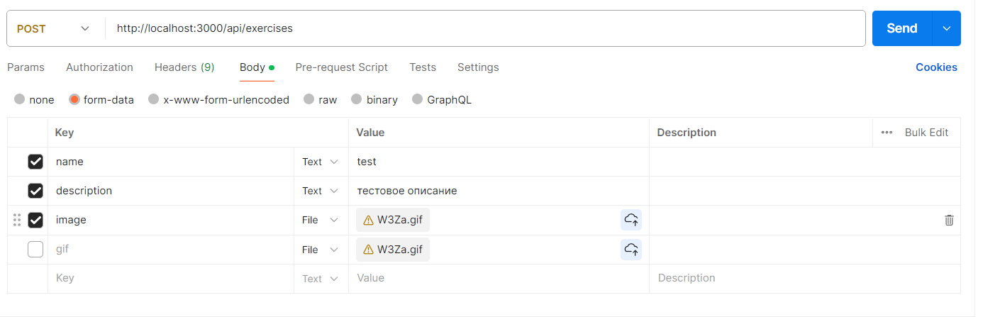
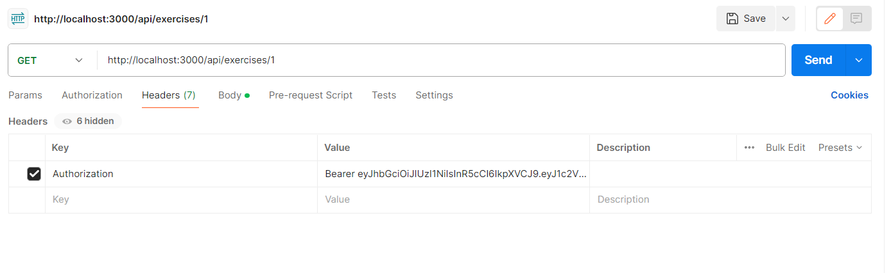
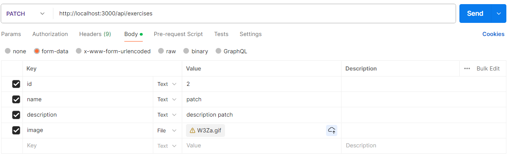
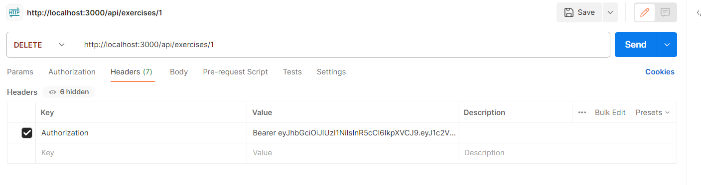

## Exercise

### Общее

Для каждого запроса необходима авторизация через jwt-token, который содержится в заголовке Authorization.
Основной адрес для работы с exercise: `{hostname}/api/exercises`.
Пример:
`Authorization : Bearer <access_token> `

### CREATE

Для создания CREATE запроса необходим _POST_ запрос на адрес
`{hostname}/api/exercises`. Отправка осуществлять через _multipart/form-data_

#### Структура

| Название поля  | Тип                        | Значение                   |
| -------------- | -------------------------- | -------------------------- |
| name \*        | String (3-256 символов)    | название упражнения        |
| description \* | String (10-1024 символов)  | описание упражнение        |
| image          | File (PNG, JPEG, WEBP GIF) | изображение                |
| video          | String                     | Ссылка на видео youtube/vk |

\* - обязательный параметр

#### Пример запроса

### READ

#### READ 1 ELEMENT

Для получения конкретного элемента, необходимо использовать _GET_-запрос на адрес `{hostname}/api/exercises/:id`, где `:id` - это id записи exercises

#### Пример запроса

### UPDATE

Для обновления exercise, необходим _PATCH_-запрос на адрес
`{hostname}/api/exercises`. Отправка осуществлять через _multipart/form-data_. Обновить упражнение может создатель упражнения

#### Пример запроса

#### Структура

| Название поля  | Тип                        | Значение                   |
| -------------- | -------------------------- | -------------------------- |
|id | String/Integer| id exercise, который мы изменили|
| name \*        | String (3-256 символов)    | название упражнения        |
| description \* | String (10-1024 символов)  | описание упражнение        |
| image          | File (PNG, JPEG, WEBP GIF) | изображение                |
| video          | String                     | Ссылка на видео youtube/vk |

\* - обязательный параметр

### DELETE
Для удаления конкретного элемента, необходимо использовать _DELETE_-запрос на адрес `{hostname}/api/exercises/:id`, где `:id` - это id записи exercises. Обновить упражнение может создатель упражнения

#### Пример запроса
