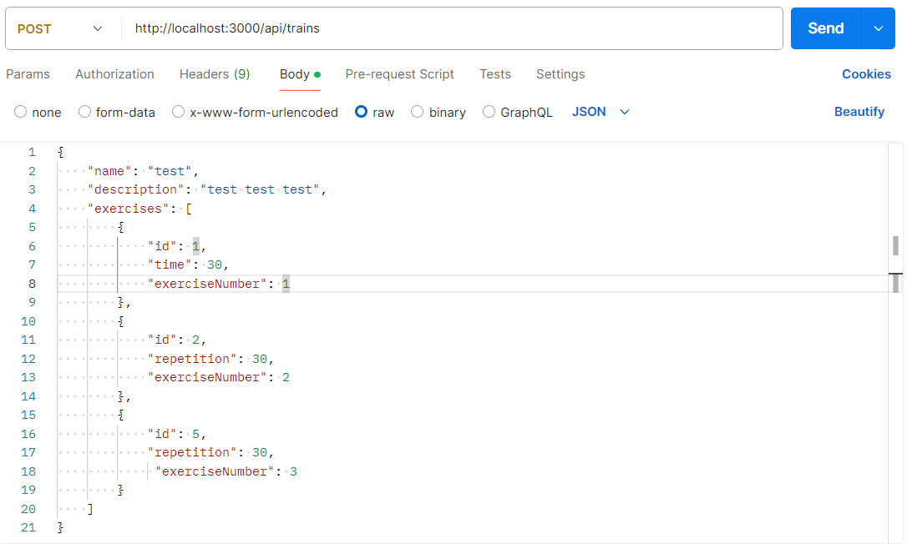
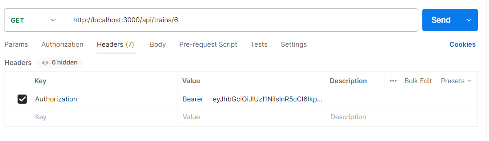
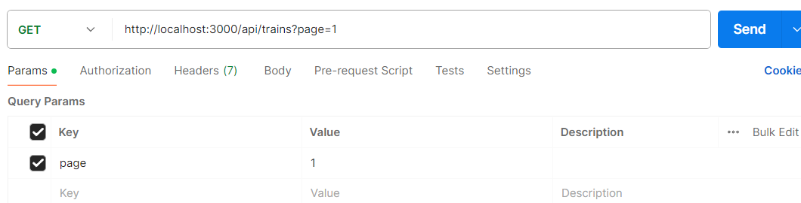
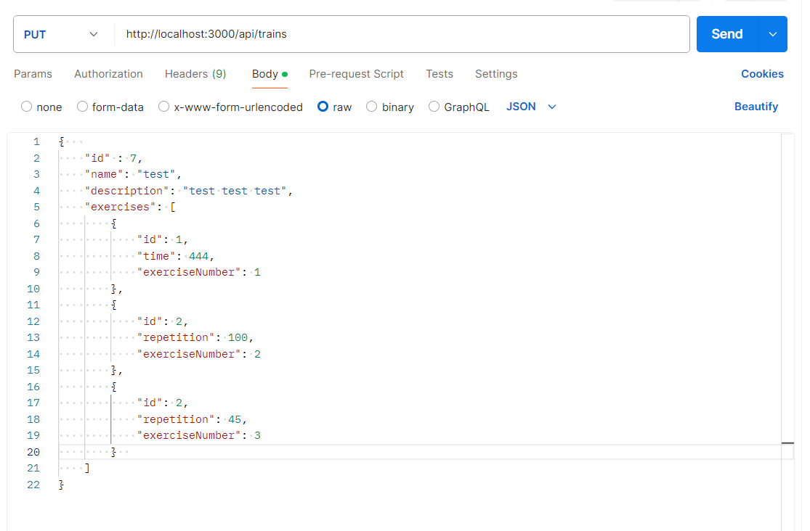
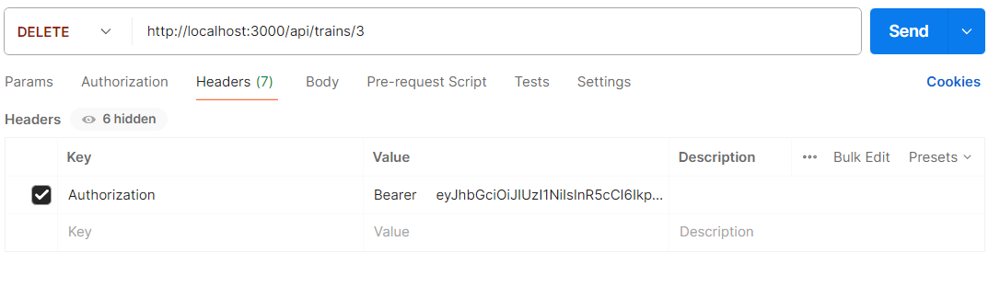

## Train

### Общее

Для каждого запроса необходима авторизация через jwt-token, который содержится в заголовке Authorization.
Основной адрес для работы с exercise: `{hostname}/api/train`.
Пример:
`Authorization : Bearer <access_token> `

### CREATE

Для создания CREATE запроса необходим _POST_ запрос на адрес
`{hostname}/api/trains`. Отправку лучше осуществлять через _json_

#### Структура

| Название поля  | Тип                       | Значение            |
| -------------- | ------------------------- | ------------------- |
| name \*        | String (3-256 символов)   | название тренировки |
| description \* | String (10-1024 символов) | описание тренировки |
| exercises      | ExercisesForTrainDTO[]    | массив упражнений   |

\* - обязательный параметр

#### Структура ExercisesForTrainDTO

| Название поля     | Тип                  | Значение                                |
| ----------------- | -------------------- | --------------------------------------- |
| id \*             | Int                  | id упражнения                           |
| exerciseNumber \* | Int                  | Номер упражнения в контексте тренировки |
| approach          | Int (по умолчанию 1) | количество подходов                     |
| time              | Int                  | Время выполнения упражнения             |
| repetition        | Int                  | Количество повторений                   |

**ЗАМЕЧАНИЕ** : может быть выбран либо параметр time, либо параметр repetition, но не оба сразу \
 \* - обязательный параметр

#### Пример json файла

```json
{
  "name": "test",
  "description": "test test test",
  "exercises": [
    {
      "id": 1,
      "time": 30,
      "exerciseNumber": 1
    },
    {
      "id": 2,
      "repetition": 30,
      "exerciseNumber": 2
    },
    {
      "id": 5,
      "repetition": 30,
      "exerciseNumber": 3
    }
  ]
}
```

#### Пример запроса



### READ

#### READ 1 ELEMENT

Для получения конкретного элемента, необходимо использовать _GET_-запрос на адрес `{hostname}/api/trains/:id`, где `:id` - это id записи trains

#### Пример запроса




#### READ MANY ELEMENT

Для получения списка элементов необходимо необходимо использовать _GET_-запрос на адрес `{hostname}/api/trains?page=_number_, где _number_ - номер страницы

#### Пример запроса



### UPDATE

Для обновления exercise, необходим _PUT_-запрос на адрес
`{hostname}/api/exercises`. Отправка осуществлять через _multipart/form-data_. Обновить упражнение может создатель упражнения

#### Пример запроса



#### Структура

| Название поля  | Тип                       | Значение            |
| -------------- | ------------------------- | ------------------- |
| id             | Int                       | id тренировки       |
| name \*        | String (3-256 символов)   | название тренировки |
| description \* | String (10-1024 символов) | описание тренировки |
| exercises      | ExercisesForTrainDTO[]    | массив упражнений   |

\* - обязательный параметр

#### Структура ExercisesForTrainDTO

| Название поля     | Тип                  | Значение                                |
| ----------------- | -------------------- | --------------------------------------- |
| id \*             | Int                  | id упражнения                           |
| exerciseNumber \* | Int                  | Номер упражнения в контексте тренировки |
| approach          | Int (по умолчанию 1) | количество подходов                     |
| time              | Int                  | Время выполнения упражнения             |
| repetition        | Int                  | Количество повторений                   |

**ЗАМЕЧАНИЕ** : может быть выбран либо параметр time, либо параметр repetition, но не оба сразу \
 \* - обязательный параметр

#### Пример json

```json
{
  "id": 7,
  "name": "test",
  "description": "test test test",
  "exercises": [
    {
      "id": 1,
      "time": 444,
      "exerciseNumber": 1
    },
    {
      "id": 2,
      "repetition": 100,
      "exerciseNumber": 2
    },
    {
      "id": 2,
      "repetition": 45,
      "exerciseNumber": 3
    }
  ]
}
```

### DELETE

Для удаления конкретного элемента, необходимо использовать _DELETE_-запрос на адрес `{hostname}/api/trains/:id`, где `:id` - это id записи exercises. Обновить упражнение может создатель упражнения

#### Пример запроса


